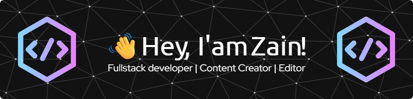

  

###

  
  

###

<h3 align="left">👩‍💻  About Me</h3>

###

I'm Zain from Jakarta  Full-Stack Developer with 1+ year of experience in building web applications. currently expanding my skill set by learning javascript, diving deep into modern web technologies. I am actively seeking a full-time role where I can leverage my existing experience and newly acquired skills in React, Node.js, and Next.js to contribute to innovative projects.

###

###

<h3 align="left">🚀 What I'm Currently Up To</h3>

###

🧠 Deepening my knowledge in Full-Stack JavaScript (MERN Stack)   💻 Building projects using React, Node.js, and Next.js.  🌱 Exploring best practices in modern web development.  🤠Open to collaborating on exciting open-source projects.

###

 

<h3 align="center">🛠 Language and tools</h3>

###

 

  
  
  
  
  
  
  
  
  
  
  
  
  
  
  
  
  
  
  
  
  

###

<h3 align="center">🔥   My Stats :</h3>

###

  
  

###

<h3 align="center">Play Games</h3>

###

<picture>
  <source media="(prefers-color-scheme: dark)" srcset="https://raw.githubusercontent.com/zainnn21/zainnn21/output/pacman-contribution-graph-dark.svg">
  <source media="(prefers-color-scheme: light)" srcset="https://raw.githubusercontent.com/zainnn21/zainnn21/output/pacman-contribution-graph.svg">
  
</picture>

###
